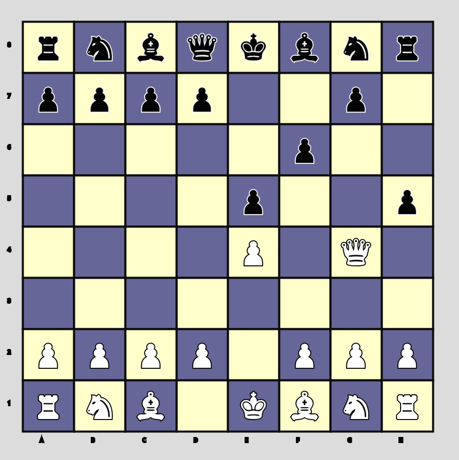

Chess Game in TypeScript with p5.js
🎯 Opis projektu

To jest projekt gry w szachy, zaimplementowany w TypeScript z użyciem biblioteki graficznej p5.js. Gra umożliwia rozgrywkę dwóch graczy na jednej planszy a także na grę z prostą implementacją AI za pomocą algorytmu miniMax() faworyzującego ruchy które są rozwijające.
🛠️ Funkcjonalności

    Ruchy figur – Obsługa wszystkich reguł ruchów dla każdego typu figury.
    Roszada – Implementacja roszady z uwzględnieniem ograniczeń.
    Szach i mat – Sprawdzanie, czy król jest pod szachem lub został zamatowany.
    Zwycięzca – Wyświetlanie komunikatu o zwycięzcy po zakończeniu gry.
    Interfejs graficzny – Szachownica renderowana za pomocą p5.js.

🖥️ Technologie

    TypeScript – Struktura i bezpieczeństwo typów.
    p5.js – Wizualizacja i interakcje.
    Git – Zarządzanie wersjami projektu.

Uruchomienie projektu:

cd chess

bun run src/index.ts

http://localhost:3000